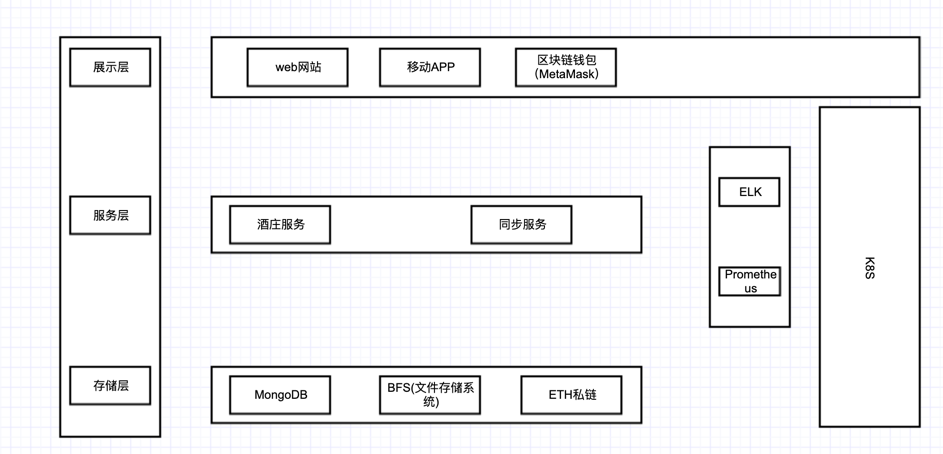
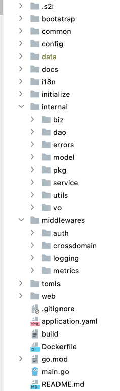
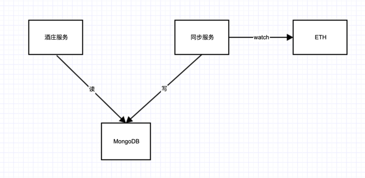
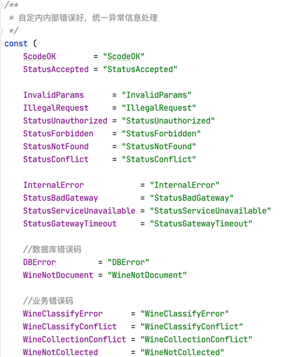
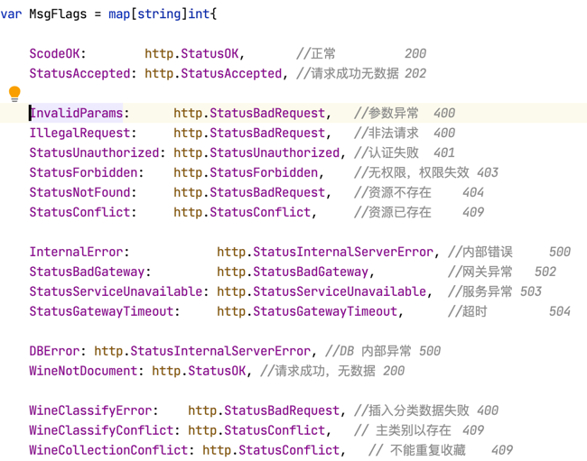
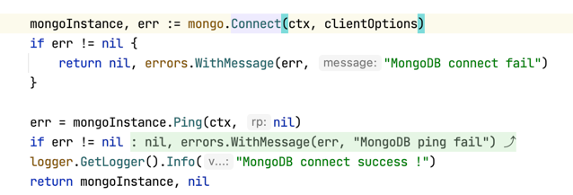
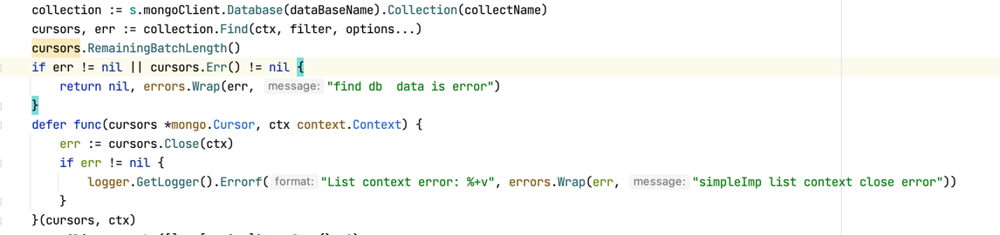

## 毕业设计

对当下自己项目中的业务，进行一个微服务改造。

### 一、项目背景

这是一个区块链项目，方向是NFT,基于区块链的数字艺术品。当然这个艺术品可以非同质化的任何东西。比如珍藏版的酒，葡萄酒、白酒，再比如是某艺术家的字画，签名后佳作，又或者是古董拍卖也可以用NFT来做等等。这里以酒庄为例，需求就是做一个红酒相关的NFT一级市场，让感兴趣的用户都可以来购买NFT。

### 二、需求分析

- 用户购买NFT
- 用户收藏NFT
- 统计相关NFT热度
- 查看交易历史记录
- 等等

### 二、API功能设计

- 铸币
- 交易
- 列表
- 详情
- 等等

### 三、架构设计

- 这个项目可以通过浏览器和移动APP访问。
- 钱包是区块链钱包，用来支付代币。
- 存储使用的是文档存储MongoDB，文件存储系统BFS，ETH部署的是私链
- 日志收集使用的是ELK
- API告警和业务数据监控使用是的prometheus，自定义metric
- K8S是私有部署

### 四、项目改进

这个项目本身就是微服务，职责单一，可独立运行，可独立部署。知识因为我们的相关服务太少了，不能集成在一起，并且规模也不行。我在这里面负责的是酒庄服务的开发，这主要是应用层的开发。听了毛老师的课，我已经把这个服务重构过了。

1. 项目工程化如下：

2. 并发的使用，ErrGroup我用在了项目的启停，优雅终止。

3. 微服务中间件使用的是Prometheus。

    用的是gin集成的prometheus的库，增加了metric界面，用来监控API的状态码，分析API成功率。

4. 缓存的使用优化

   
   
   - 用户上链的数据需要频繁地读，比如NFT的凭据，交易事件，如铸币，交易，赠与等。如果直接读链，这样的操作对链的压力很大，如果是公链的话，速度就更慢了。所以这些数据存在了MongoDB中，方便用户操作。 
   - 这里的同步服务，会订阅ETH，watch事件，解析事件数据，写入MongoDB中，然后酒庄服务就可以去读。做一些数据展示和数据状态的改变。比如排行榜，汇总数据，交易历史等。
   - 问题：
     - 如果说会有问题的话，应该是同步服务，它不是高可用，只做一个同步机制。
     - 如果同步服务挂掉，或者重启，这个时候，是无法重新获取ETH中的事件，属于事件丢失。这个时候需要进入补偿机制。
     - 比如说，盘库，对比ETH之前历史，把缺少的数据重新写入Mongodb中，但是这个成本很高。一般不采取这个措施。
     - 另一个就是人工介入，这个问题只会出现在交易，不会出现在铸币。因为铸币都是商家直接铸币好的，如果有错误就会自己解决。如果交易出现同步服务挂掉，最终结果是查询交易日志失败，我们记录这个交易Hash，然后通过后台，从ETH上再拉一遍，把数据同步过来。 
   - 缓存解决了快速访问ETH数据，因为ETH访问本来就慢，所以写操作，如铸币，交易等，不需要实时性，保证最终一致性即可。通过区块链浏览器查询保证一致即可。
    
5. API设计
   
    采用的是Restful API，遵循其规范和api命名。gin集成swagger，使用在线API文档。
   
6. 错误码规范

    -  这里采用的是自定义内部错误码，来区分不同的业务的错误。加入了国际化字段。
    
    - 内部错误码定义
        
        
      
    - 内部错误码对应http code

        

    - 国际化中文
      
        

   - 国际化英文

        
    
7. ERROR使用

    - 这里的error采用的是github.com/pkg/errors这个库，学会了把根因包括起来，往上返回error，也学会了打印错误日志时候获取根因，获取错误的堆栈信息打印到日志。
    - 为根因增加错误信息
    
         
    
    - 获取根因判断数据的空数据
    
         
      
    - 返回错误堆栈
    
        
    
8. grpc涉及到两个项目都有改动，所以这个我在此项目中没有体现，ProtoBuf也没有用上，还是使用自己手写的返回结构体，确实还挺麻烦。

### 五、总结

- 这个项目是我听完毛老师的课之后，进行重构的。结合当下项目情况，觉得以下几个部分用得好。
  - 用到了go的工程化 
  - error的处理
  - API的设计
  - errGroup的使用
  - 错误码的规范
  - 缓存设计的思想，参考了微服务架构的部分思想在项目组内讨论。
- 不足的地方是
  - 没有用到gRPC 
  - ProtoBuf， 
  - 链路追踪 
  - errGroup并发控制没有用到核心业务代码上，KAFKA做消息队列也没有用上。
  - 微服务架构没有落地，架构师说还没到时候，先搞出点东西出来😭 
   
- 下一步计划
  - 尝试把grpc和 ProtoBuf引入到项目中。
  - 将 errGroup用熟练，引入到项目中。
  - 在项目组内探讨下链路追踪方案
  - KAFKA和微服务这个要看项目进展和架构需求了。
   
### END